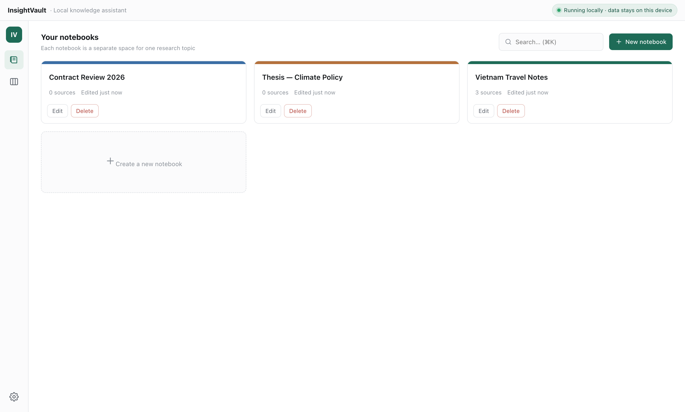
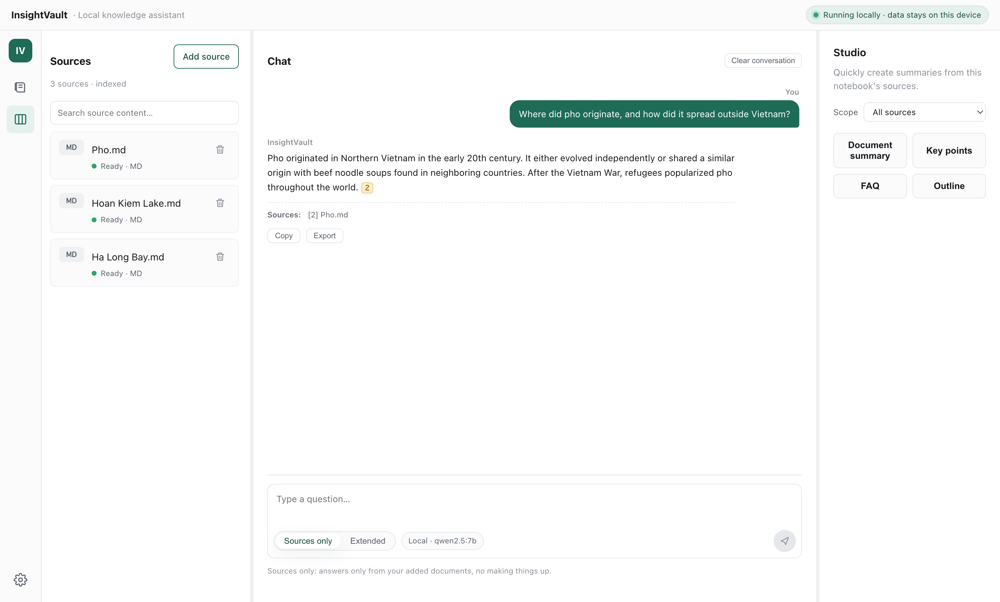
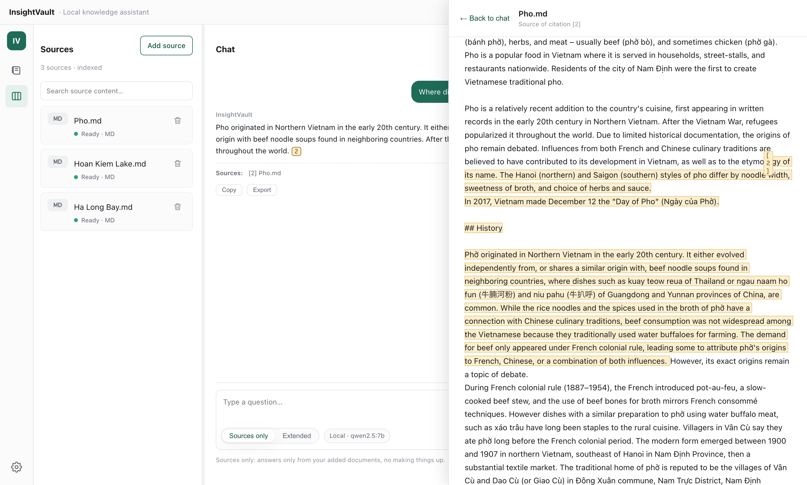
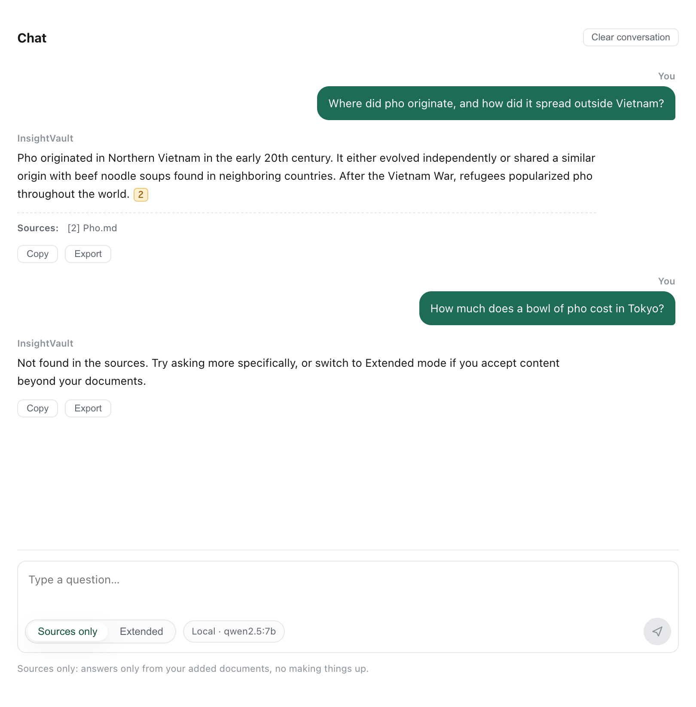
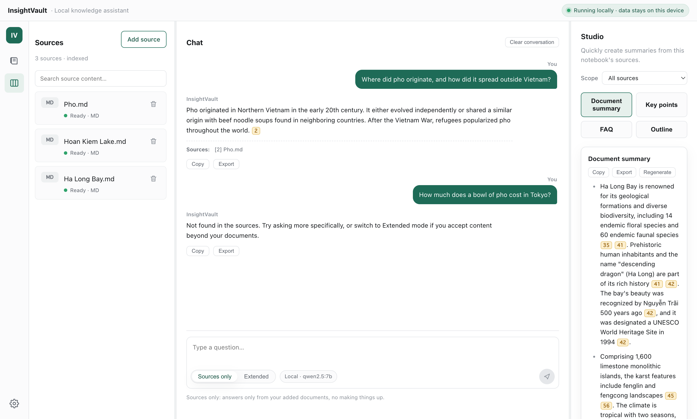
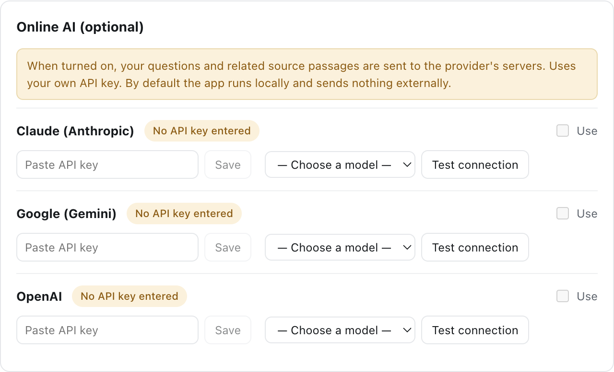
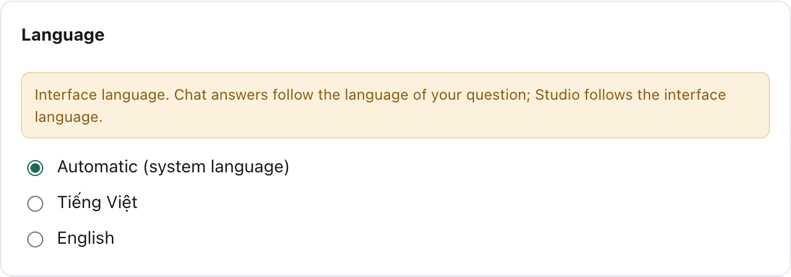
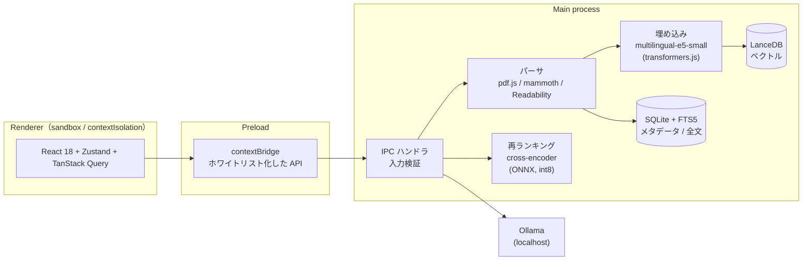
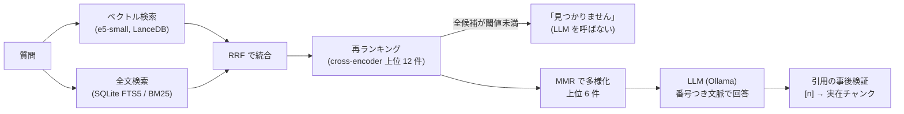

# はじめに

社外秘の契約書、取材メモ、未発表の研究データ……。「AI に読ませて質問したいけど、クラウドにはアップロードしたくない」という資料は意外と多いのではないでしょうか。

そこで、**資料を一切外に出さずに、手元の PC だけで NotebookLM のような体験ができるデスクトップアプリ** **InsightVault** を作りました。MIT ライセンスのオープンソースで、macOS（Apple Silicon）と Windows に対応しています。

- GitHub: https://github.com/hoanghainh1188/insight-vault
- ダウンロード: https://github.com/hoanghainh1188/insight-vault/releases/latest

この記事の前半ではアプリの紹介を、後半では次のような実装上の工夫を紹介します。

- Electron のセキュリティ境界の切り方
- ハイブリッド検索（ベクトル + 全文検索）
- 「AI がでっち上げた引用」を表示しない仕組み
- 資料に答えがない質問を、LLM に渡す前にローカルの小さなモデルで弾く方法（実測値つき）

# どんなアプリか

## 3 つの原則

| 原則                   | 意味                                                          |
| ---------------------- | ------------------------------------------------------------- |
| **ローカルファースト** | 既定の設定では、データは一切 PC の外に出ない                  |
| **検証可能**           | すべての回答に、根拠となる資料の該当箇所への引用 `[n]` がつく |
| **オフラインで自立**   | インターネットがなくても動く。モデルもコストも自分で選べる    |

## ノートブックに資料を入れる

資料は「ノートブック」単位で管理します。PDF、`.docx`、`.txt`、`.md`、Web ページ（URL）に加え、音声・動画（Whisper でローカル文字起こし）や画像（ローカル OCR）も読み込めます。



## 引用つきで質問に答える

ノートブックを開くと、「ソース一覧・チャット・Studio」の 3 カラム構成になります。回答はストリーミングで表示され、文中の `[1]` `[2]` のようなチップが根拠の箇所を指します。



チップをクリックすると、ソースビューアがその段落までスクロールし、該当部分をハイライト表示します。PDF ならページと位置、音声・動画ならタイムスタンプまで飛びます。



## 「資料に書いていないこと」には答えない

既定の「ソース準拠」モードでは、資料に答えがない質問に対して **推測で答えず「ソース内に見つかりません」と返します**。たとえば、フォー（Pho）の Wikipedia 記事しか入れていないのに「東京でフォーは一杯いくら？」と聞いた場合がこれにあたります。



この判定には後述のローカル再ランキングモデルを使っており、LLM を呼ぶ前に結果が返るため応答もすばやくなります。

## Studio：ノートブック全体の要約

右カラムの Studio では、ノートブック全体から次のものを生成できます。

- 要約
- 要点
- FAQ
- アウトライン

大きなノートブックは分割して処理しますが（map-reduce）、引用は元の段落を正確に指したままです。結果は Markdown として書き出せます。



## 設定

- **AI プロバイダー**：既定はローカルの Ollama。Claude / Gemini / OpenAI を自分の API キーで使うこともできます。キーは OS のキーチェーンに保存されます。
- **プライバシーバッジ**：オンライン AI を使っている間は、データが外に出ていることがバッジで常に表示されます。
- **表示言語**：英語 / ベトナム語。
- **関連度チェッカー**：状態を確認できます。
- **バックアップ**：AES-256-GCM で暗号化したバックアップファイルを作成できます。





# 使い方（3 ステップ）

1. [Releases](https://github.com/hoanghainh1188/insight-vault/releases/latest) からインストーラーをダウンロードします。macOS は `.dmg`、Windows は `Setup.exe` です。
2. [Ollama](https://ollama.com) をインストールし、チャット用モデルを取得します。アプリが RAM に合ったモデルを提案してくれます。

   ```bash
   ollama pull qwen2.5:7b
   ```

3. アプリを起動し、ノートブックを作って資料を追加します。

埋め込み・関連度チェッカー・文字起こし・OCR のモデルはアプリ内で動作し、初回利用時に一度だけダウンロードされます。

:::note warn
現時点ではコード署名をしていません。macOS では右クリック →「開く」、Windows では SmartScreen の「詳細情報 → 実行」で起動してください。
:::

# 技術的な話

## 全体構成



| レイヤー             | 技術                                                            |
| -------------------- | --------------------------------------------------------------- |
| シェル               | Electron + electron-vite                                        |
| UI                   | React 18 + TypeScript · Zustand · TanStack Query                |
| メタデータ・全文検索 | SQLite（FTS5）                                                  |
| ベクトルストア       | LanceDB（組み込み型）                                           |
| 埋め込み・ASR・OCR   | transformers.js（multilingual-e5-small, Whisper）· tesseract.js |
| チャット LLM         | Ollama（ローカル）· 任意で Claude / Gemini / OpenAI             |
| テスト               | Vitest · Playwright `_electron`                                 |

## 1. セキュリティ境界：Renderer には何も持たせない

ローカルファーストを謳う以上、「うっかり外に送ってしまう」経路を構造的に作らないことが重要です。

- Renderer は `sandbox: true`、`contextIsolation: true`、`nodeIntegration: false` で動かします。
- ファイルシステム・DB・モデル・ネットワークへのアクセスは **すべて Main プロセス** に置きます。
- Preload では、チャンネル名をホワイトリストにした型付き API だけを `contextBridge` で公開します。
- IPC の入力は境界で検証します（ID の形式、文字列長、パレットにない色など）。
- **既定ではネットワーク通信がゼロ** です。外に通信するのは次の 2 つだけで、それぞれ UI に明示されます。
  - オンライン AI を有効にしたとき（プライバシーバッジを表示）
  - 初回のモデルダウンロード
- 新しいウィンドウの生成やページ遷移（`setWindowOpenHandler` / `will-navigate`）は拒否します。`shell.openExternal` には検証済みの URL しか渡しません。

## 2. ハイブリッド検索：ベクトル + BM25 → RRF → MMR

ベクトル検索だけでは、固有名詞・型番・条文番号のような「字面が一致してほしい」質問に弱くなります。一方、全文検索だけでは言い換えに弱くなります。そこで両方を使います。



- **RRF（Reciprocal Rank Fusion）**：スコアの尺度が違う 2 つの検索結果を、順位だけで統合します。調整すべきパラメータが少なく安定します。
- **MMR（Maximal Marginal Relevance）**：同じ段落の焼き直しばかりが上位に並ばないよう、多様性を加えて最終 6 件を選びます。
- **e5 の接頭辞**：multilingual-e5 は `query:` / `passage:` の接頭辞を付けないと精度が落ちるので、必ず付けています。

## 3. 「でっち上げ引用」を表示しない：引用の事後検証

LLM には、文脈を `[1]` 〜 `[6]` の番号つきで渡します。ただし **LLM が出力した番号はそのまま信用しません**。

```ts
// 文脈に実在するチャンクに対応づけられる [n] だけを残す。
// 範囲外の [n] は回答テキストから取り除き、引用リストにも入れない。
export function postprocessCitations(
  rawAnswer: string,
  map: Map<number, RetrievedChunk>,
) {
  const seen = new Set<number>();
  const citations: Citation[] = [];
  const answer = expandGroupedCitations(rawAnswer) // "[1, 2]" や "[1-3]" を個別のチップに展開
    .replace(/\[(\d+)\]/g, (_whole, digits: string) => {
      const n = Number(digits);
      const rc = map.get(n);
      if (!rc) return ""; // 存在しない番号 → 削除
      if (!seen.has(n)) {
        seen.add(n);
        citations.push({
          n,
          chunkId: rc.chunk.id,
          sourceId: rc.chunk.sourceId /* … */,
        });
      }
      return `[${n}]`;
    });
  return { answer, citations };
}
```

こうした処理は純粋関数にしておき、モデルなしで決定的にユニットテストできるようにしています。チップに紐づくのは「チャンク ID + 元文書内のオフセット / ページ / タイムスタンプ」です。そのため、ビューアは常に **実在する箇所** だけをハイライトします。

## 4. 答えがない質問を LLM の手前で弾く：ローカル cross-encoder

RAG でよくある悩みが、**資料に答えがないのに、それっぽい段落が検索に引っかかり、LLM がもっともらしく答えてしまう** 問題です。特に「話題は同じだが、聞かれている細部が資料にない」質問（hard negative）が厄介です。たとえば、フォーの記事に対して「東京での値段は？」と聞くような場合です。

最初は検索スコアの閾値で判定しようとしました。しかし、ハイブリッド検索のスコアでは「関連はあるが答えではない」段落と「答えを含む」段落を分けられず、hard negative の正しい拒否率は **0%** でした。

そこで、RRF の後に **小さな多言語 cross-encoder** を挟みました。

- モデル：`cross-encoder/mmarco-mMiniLMv2-L12-H384-v1`（Apache-2.0）
  - ONNX を int8 量子化したもの（arm64 用・AVX2 用）を使用
  - 約 120 MB
  - 初回にバックグラウンドで一度だけダウンロード
  - リビジョンを固定して再現性を確保
- 対象：RRF 上位 12 件
- 入力長：最大 256 トークン
- 判定：すべての候補が閾値 0.6 未満なら「見つかりません」を返し、**LLM を呼ばない**
- フェイルオープン：モデルの準備中・ビジー・1.5 秒のタイムアウト・エラーのときは再ランキングを飛ばし、従来どおり回答します。チェッカーが原因で Q&A が止まることはありません。

### 評価：開発セットとホールドアウトを分けて測る

閾値を「当たるまで調整」するのを避けるため、評価の仕組みと手順を固定しました。

- 評価ハーネス `npm run eval:retrieval` と、公開ライセンスのテスト用コーパスを用意しました。
- 質問は開発用（閾値の選択）とホールドアウト（確認のみ）に分けました。
- 合格条件は事前に決めておき、Wilson の 95% 信頼区間の下限でも判定しました。

**評価データ（v3）**

| 言語       | 答えがある質問 | 答えがない質問 |
| ---------- | -------------- | -------------- |
| ベトナム語 | 82             | 32             |
| 英語       | 22             | 12             |

**結果**（「正しい拒否」＝答えがない質問を拒否できた割合）

|                          | 正しい拒否（vi ホールドアウト） | 正しい拒否（en） | Recall@6（vi ホールドアウト） | 追加レイテンシ    |
| ------------------------ | ------------------------------- | ---------------- | ----------------------------- | ----------------- |
| 導入前（スコア閾値のみ） | 0%                              | 0%               | 95.8%                         | —                 |
| **導入後**               | **100%（10/10）**               | **75%**          | **95.8%**                     | p50 0.23〜0.37 秒 |

**比較のために測った別モデル**：`gte-multilingual-reranker-base`（q8, 341 MB）は拒否率では同等でした。しかし英語の Recall@6 が 31.8% まで落ち、p95 も 13.9 秒だったため不採用にしました。小さいモデルのほうが、このユースケースでは良い結果でした。

**エンドツーエンド**：qwen2.5:7b と組み合わせると、ベトナム語ホールドアウトで答えがない質問を 10/10 拒否できました（導入前は 5/6〜6/6 で揺れていました）。答えがある質問は、24 問すべてで有効な `[n]` つきの回答になりました。

**トレードオフ**：開発セットでは、答えがある質問の約 10% も「見つかりません」になります。そのため UI では「もっと具体的に聞く」「拡張モードに切り替える」という次の一手を必ず提示しています。

## 5. 多言語 UI（英語 / ベトナム語）

i18n は自前の小さな仕組みです。

- 文字列はドメインごとのファイルに分け、型付きのキーで参照します。
- Main プロセス（OS メニュー、ダイアログ）と Renderer で同じ辞書を共有しています。
- 初回起動時は OS の言語に従い、設定から即時に切り替えられます。
- チャットは **質問の言語で** 回答し、Studio は UI の言語で書きます。
- Windows の NSIS インストーラーも多言語に対応しています。

## 6. テストと開発プロセス

- **Vitest**：ビジネスロジックのカバレッジ 80% 以上を CI で強制しています。
- **Playwright の `_electron`**：E2E で実際のウィンドウを操作します。重いモデルは環境変数で決定的なフェイク実装に差し替えます。
- **評価ハーネス**：検索品質（Recall@k、正しい拒否率）を CI でレポートします。
- **仕様駆動の開発**：機能ごとに GitHub Spec Kit で spec → plan → tasks を作成し、曖昧な点の決定はすべて ADR として残しています。

# おわりに

「AI に資料を読ませたいけど、外には出したくない」という人のためのツールです。率直な感想、バグ報告、機能の提案を歓迎します（Issue は英語でも大丈夫です）。

- ⭐ GitHub: https://github.com/hoanghainh1188/insight-vault
- 📦 ダウンロード: https://github.com/hoanghainh1188/insight-vault/releases/latest

---

**スクリーンショットについて**：画面例では、英語版 Wikipedia の記事「[Pho](https://en.wikipedia.org/wiki/Pho)」「[Hoan Kiem Lake](https://en.wikipedia.org/wiki/Hoan_Kiem_Lake)」「[Hạ Long Bay](https://en.wikipedia.org/wiki/H%E1%BA%A1_Long_Bay)」の本文（プレーンテキスト）を Markdown ファイルとして読み込んでいます（[CC BY-SA 4.0](https://creativecommons.org/licenses/by-sa/4.0/)、© Wikipedia contributors）。回答は qwen2.5:7b をローカルで実行して生成したものです。
